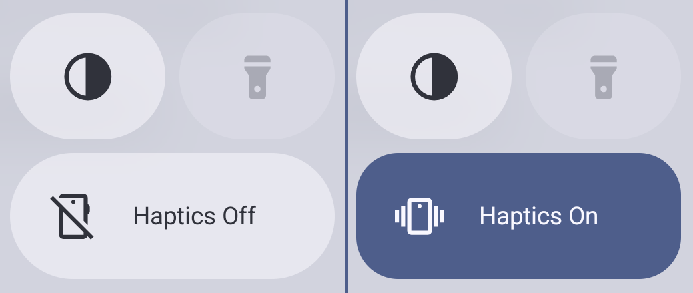
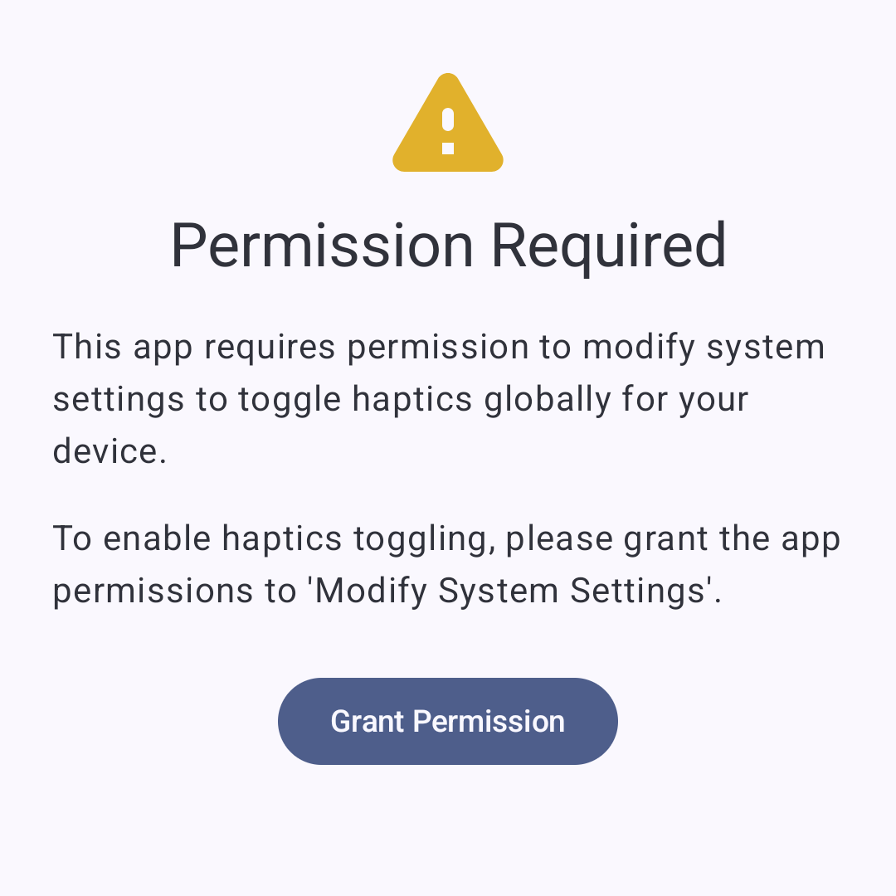
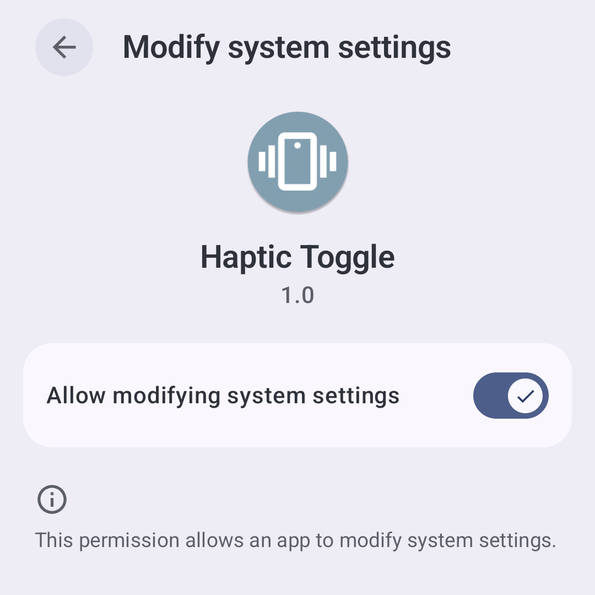
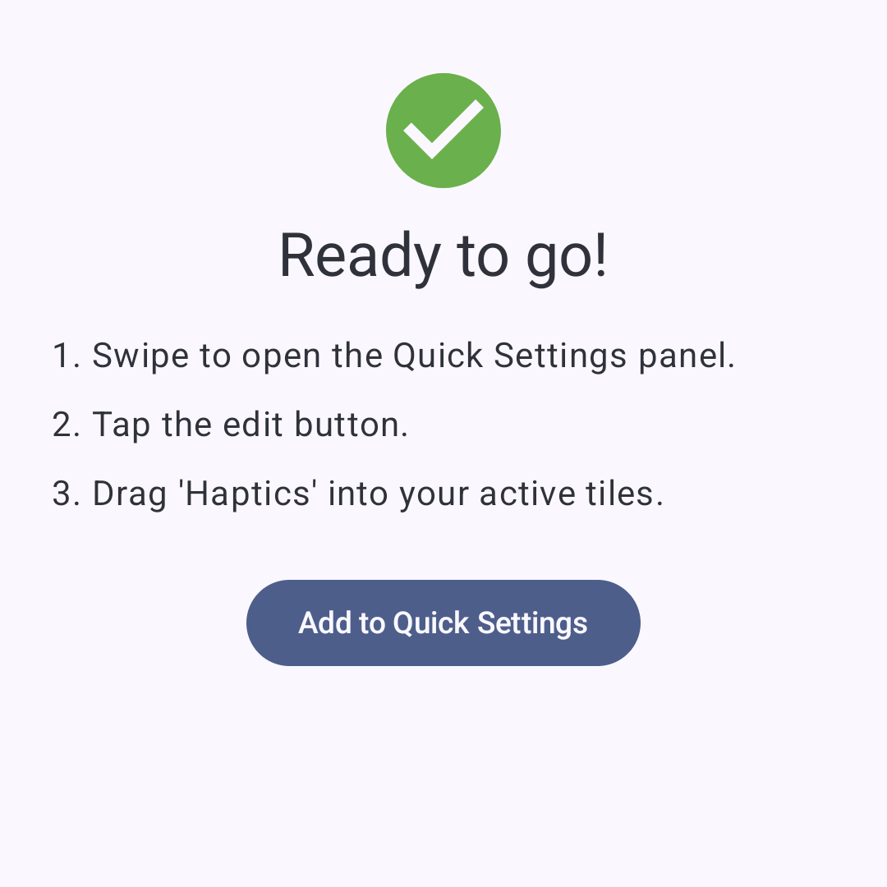
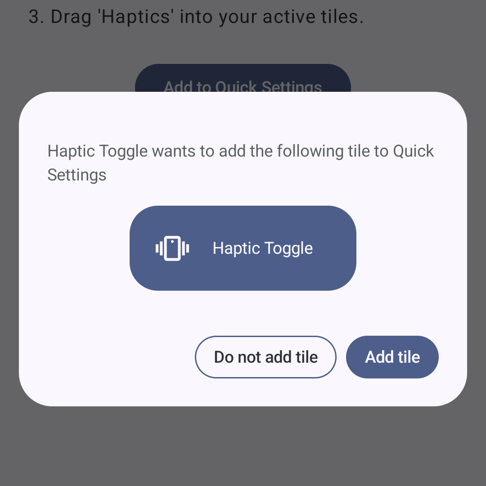
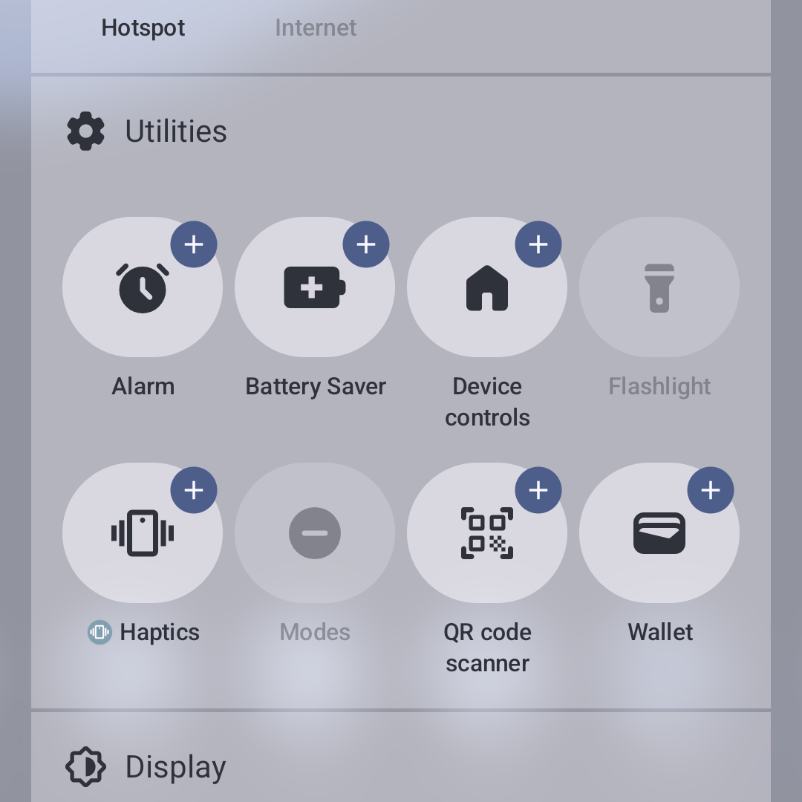
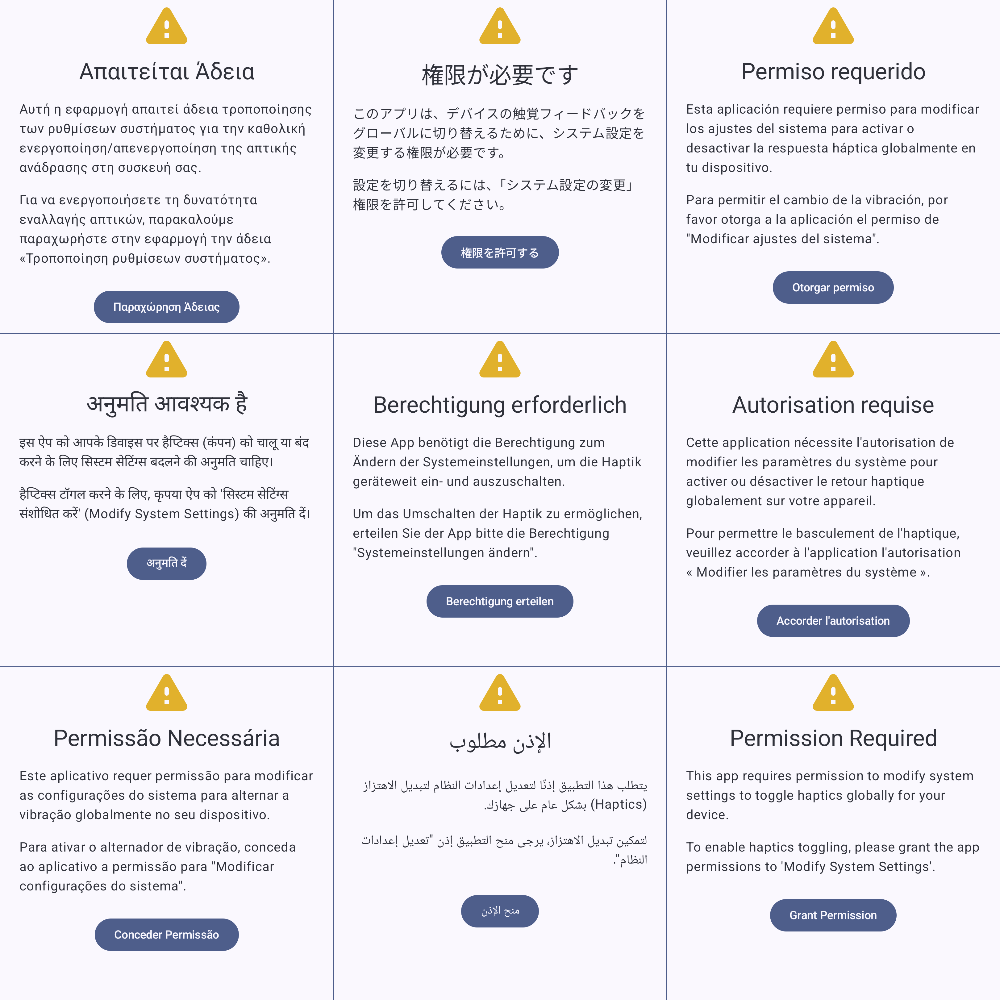

# Haptic Toggle

Toggle system-wide vibration and haptic feedback instantly from your Quick
Settings.

Tired of diving deep into System Settings just to turn off vibration or haptic
feedback? Haptic Toggle adds a convenient Quick Settings tile to your
notification shade, allowing you to enable or disable global haptics instantly.

Works on Android 7 (Nougat) and above.

## Permissions

To toggle vibration and haptic system-wide, Android requires the "Modify System
Settings" permission. The app provides a clear, one-time setup process to help
you grant this safely. Haptic Toggle does not read or modify any other settings.

In order to toggle haptics globally, the app needs to be granted the
`android.permission.WRITE_SETTINGS` permission.

This is a very powerful permission. The end users informed consent for this
permission is sought by the app when it loads.

## Flow

### Permission Overview

When the app first launches, it displays a request for permissions. It explains
why the app needs the permissions requested. It gives the user a button which
deep-links into the settings app where the user needs to take action.

### Grant Permission

When the user clicks the `Grant Permission` button they are deep-linked into
settings.

From here, once the permissions are granted, the user can go back to the app.

### Prompt to Add Quick Settings Tile

If the app is opened with the requisite permissions, it will show guidance to
the user on adding the quick settings tile to the shade.

On Android Tiramisu and Up (API 33) the user will see a button to allow easy
adding of the quick settings tile.

This is built-in Android System UI for letting the user easily add the tile.

## Tile Category

For launchers which use them (Such as the Pixel Launcher) the tile is
categorised as a "Utility".

## Localisation

The apps text has been machine localised into 8 languages (with English being
the native default 9th). This AI translation has not been checked for accuracy.

## Privacy Policy

The privacy policy can be found [here](PrivacyPolicy.md). It states that no
information whatsoever is collected by the app. The permissions requested are
solely for the purpose of toggling haptics globally on the device.